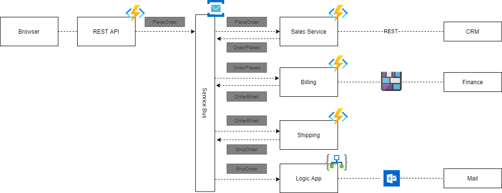

# Retail demo environment using NServiceBus & Azure Functions

This demo uses `Azure Functions`, `Azure Logic Apps` and an `Azure Service Bus` as a message broker.
It is created to demo Serverless Microservices using Azure Serverless components. 



## Flow of messages
1. The rest api places an order.
2. The sales functions app handles the `PlaceOrder` message.
    - It contacts CRM via an HttpClient
3. The sales functions app sends an `OrderPlaced` message.
4. The billing functions app handles an `OrderPlaced` message.
    - It creates a blob which is read by the Finance system.
5. The billing functions app sends an `OrderBilled` message.
6. The shippings functions app sends an `OrderBilled` message.
7. The shippings functions app sends an `ShipOrder` message.
8. The logic app handles an `ShipOrder` message.
    - It sends an e-mail to me.


## Deployment

### Scaffold a local function app
```bash
func new
```

* dotnet (isolated proces)
* Choose trigger
* Enter <function name>

### Create Azure Resources
```bash
az group create --name AzureFunctionsQuickstart-rg --location westeurope
az storage account create --name <STORAGE_NAME> --location westeurope --resource-group AzureFunctionsQuickstart-rg --sku Standard_LRS
az functionapp create --resource-group AzureFunctionsQuickstart-rg --consumption-plan-location westeurope --runtime dotnet-isolated --functions-version 3 --name <APP_NAME> --storage-account <STORAGE_NAME>
```

### Deploy Azure Function App
````bash
func azure functionapp publish <AppServiceName> -i
```